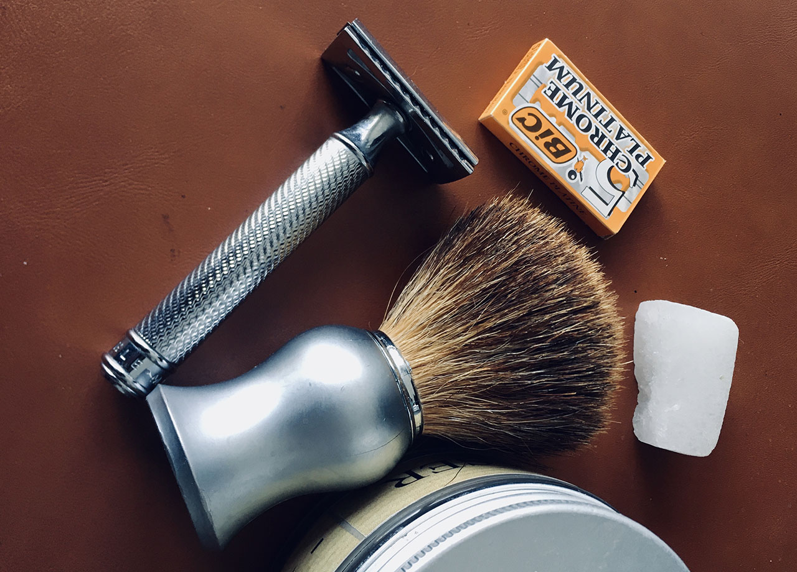

# Lo que he aprendido sobre Diseño… afeitándome

Por suerte o por desgracia mi barba no da para parecer un leñador canadiense… y ya hace muchos años que descubrí el camino del Afeitado Tradicional. Recorriéndolo he aprendido bastantes cosas que se pueden aplicar, aunque parezca extraño, a mi trabajo.

Y es que no tuve la suerte, el coraje o la pasta para estudiar Diseño así que me ha tocado aprender por caminos sinuosos. El afeitado es uno de ellos.

### Camino de iniciación

Cuando me fui de casa, mi padre, como si de un rito de iniciación de una tribu fuese… me regaló un taladro (que aún tengo) y una afeitadora Philips. Hubo intentos con distintas maquinillas y espumas industriales, pero no sirven cuando tienes cuatro pelos y tardas dias en afeitarte.

La maquinilla eléctrica parece una buena solución y solo lo es si lo haces a diario. Algo que mi anterior generación lo tenía claro. Era impensable salir a la calle sin afeitarse. Mi suegro con 93 años aún lo hace.

El problema de las elécticas es su propia condición. Se calientan y no es bueno para la piel la fricción con metal caliente. Además si la barba está un poco larga se engancha y te la arranca, en vez de cortarla. Se que ahora hay nuevos modelos, pero para mi plantean el mismo problema. Algunas se puede combinar con espuma, otras son incluso sumergibles. Pero como en muchas ocasiones la realidad no es tan bonita como los anuncios.

### Problemas de Diseño

El gran problema del afeitado ha sido el mismo que el de las cafeteras de capsulas. La avaricia. Y es que las marcas han creado sistemas propietarios. Cabezales que solo sirven para el mango que te han vendido, probablemente bajo coste, previamente.

Una vez que tienes un sistema estás obligado a comprar cabezales de la marca. Hay versiones alternativas, pero las marcas cambian el sistema (¿Te suenana las cápsulas de café que giran?) y es complicado encontrar los antiguos recambios.

El sistema de lanzamiento recuerda mucho a los antiguos albunes de cromos que te regalaban en el colegio, el primero era gratis (me han dejado maquinillas en el buzón, con la compra de otros productos, pidiéndola gratis online…) pero el negocio estaba en los sobres de cromos (sospecho que que los últimos no estaban distribuidos en tu provincia) y en los cabezales en el caso del afeitado.

Claro que llegaba un tiempo el tiempo en que era difícil encontrar una nueva "innovación". Algunas veces era el tipo de cabezal, otra la conexión, pero la mayoría de las veces no sabían que hacer:

"A que no hay… de ponerle una cuchilla más" y claro, sujétame el cubata. Así que pasamos de dos a tres y creo que perdí la cuenta al llegar a cinco, si no fuese triste, sería hasta cómico.

### La solución estaba delante de nuestras narices, menos pero mejor

Como ocurre con muchas otras cosas, la respuesta estaba en mirar un poco hacia atrás: devolver los envases de vidrio, volver a hacer pan con masa madre, coser o reparar prendas y calzado.

En el caso del afeitado siempre lo tuvimos. Existe la opción de las navajas, pero ese es un mundo complejo. Me refiero a las tradicionales cuchillas de afeitar, desmontables, metálicas… muy fáciles de mantener y que pueden durar toda la vida.

Lo único que hay que hacer es reemplazar la cuchilla cuando pierde el filo. Y puedo asegurar que duran bastante. Me arrepiento, por que en su dia perdí una puja en ebay de un afilador de cuchillas, un ingenioso aparato con dos piedras de afilar redondas, en un estuche compacto, que servía para afilar las cuchillas, aunque supongo que se usaban en tiempos donde eran más gruesas y lo permitían, en la actualidad son muy finas y no creo que tenga sentido.

### Una sola cuchilla, más que suficiente

Fácilmente puedes encontrar cuchillas por menos de 20 céntimos la unidad. Decenas de veces más económicas que las versiones multicuchilla. Y por experiencia puedo decir que el resultado es magnífico. Aquí interviene los materiales que uses, tu técnica, etc.

### Jabón, un mundo de posibilidades

Al igual que en una cámara lo importante es la lente y el ojo del fotógrafo, en afeitado es nuestra mano y el jabón que utilicemos. Aquí hay mil opciones. Lo bueno es que hay opciones muy baratas, con una barra de La Toja puedes funcionar perfectamente y creo que son menos de dos euros y a partir de ahí lo que quieras. Yo aún tengo un bote de Martín de Candre, que me regaló un amigo. Se supone que es el mejor jabón de afeitar o al menos el más famoso y no consigo acabarlo, así que aunque algunos productos cuesten dinero cunden mucho. Un buen jabón meses, una brocha años y una maquinilla o una navaja toda una vida y aún se podrá dar en herencia.

### El kit básico

Lo más básico es una maquinilla (poco más de 30 euros), un jabón y una brocha, preferiblemente de cerdas sintéticas. Con eso ya tienes para aburrirte.

Las brochas famosas son las de tejón, se clasifican por su tono y calidad, pero desde hace mucho en la Unión Europea no se permite la caza o crianza de estos animales. Todas las que están en el mercado se fabrican con pelo de tejón criado en cautividad en China, así que imagínate las condiciones de vida de esos pobres animales.

Las sintéticas son igual de buenas y más asequibles. Estamos en un campo en que te puedes gastar lo que quieras, cachas de nacar, porcelana, cuero… lo básico hace su trabajo perfectamente. Hablamos de diseño y funcionalidad.

### Viajar en avión

Ojalá pronto poder volver a viajar habitualmente. En este caso se puede llevar la maquinilla demontada y comprar los recambios en destino, es fácil y económico, en la mayoría de droguerías y perfumerías tradicionales. Además hay países como Portugal en que hay auténticas maravillas. Por cierto un país con muy buena cultura en este campo.





### Después del afeitado

Mi manera de diferencias en inglés "before" and "after" es acordarme del _after save_. Mi opinión es que si usas un buen jabón no necesitas nada más. De hecho existe el concepto "espuma de confort" que es una capa que te das en la cara cuando ya has terminado. Una manera de que los componentes que tiene actúen como calmante, antiséptico y suavice la piel. Funciona.

Existe algo bastante curioso que es la piedra de alumbre, y que es eso mismo, un mineral que sirve para los pequeños cortes y como antivacteriano. Deja la piel seca y con un poco de agua fría listo.

### Empatía

Yo llegué a esta vuelta al pasado por frustración pero sobre todo por empatía con mi chica. No solo me afeito por mi, sino por mi pareja. Una barba de dos días, son como agujas, y pueden dejar marcas en la piel, además de no ser nada agradable, haz la prueba rascándote tu mismo. El modelo del vaquero que se encendía el cigarro rascando la cerilla con su barba está, afortunadamente, desfasado. A no ser que quieras pasar meses sin un buen beso.

### Bienvenido al mundo del "ahorro ficticio"

Hasta aquí la parte práctica, pero como me dijo un tipo que tenía al menos diez navajas: "bienvenido al mundo del ahorro ficticio" y es que como seas consumista, no es mi caso, te encontrarás con un monton de botes y cachivaches que no serás capaz de terminar y en los que te habrás dejado una pasta. Así que control. Es como los vinos cada uno se gasta y evoluciona hasta donde quiera. Yo soy feliz con una botelle de vino de diez euros o menos.

Aún así a nivel de diseño hay temas muy interesantes. No todo el mundo tiene una barba igual. Algunos la tienen muy tumbada o con propensión a que algunos pelos vuelvan a entrar en la piel, otros muy dura. Y ahí una navaja o una savette puede ser muy buena opción. Eso si, como una katana, hay que aprender a usarla o correrá sangre innecesaria.

Si quieres ir un paso más allá, como los "cocinillas" que se comprar cuchillos japoneses, también existe su versión de afeitado. Las navajas Kamisori, que para mi son fascinantes pero temibles al mismo tiempo.



Son ya muchos años, pero me parece una reflexión interesante el volver a los orígenes para recuperar diseños que funcionan mejor, tienen menos impacto en el plantea y a nivel de experiencia hacen que algo, para mi desagradable, se convierta en un pequeño rito recurrente.

### Aprendizajes sobre diseño

* Cuando todo es una mierda es el momento de mirar atrás (pan, cerveza, repostería… o afeitado) creo que es una buena práctica aplicable a cualquier sector o profesión.
* Nadie nace aprendido. El afeitado es un conocimiento que se transmite de padres a hijos. Aunque luego cada uno busca su camino.
* Un buen afeitado debe ser placentero, un momento Zen de reflexion y pausa.
* Cuanto más te afeitas mejor lo haces y mejores resultados consigues. Creo que incluso la piel se habitúa.
* Es mucho más sostenible. El impacto es menor. El jabón puede ser artesanal, en bote de cristal o madera, con recambios.
* Una vez tengas lo básico, lo único que necesitas son cuchillas. Se amortiza rápido, puedes hacer números.
* A veces, como con las brochas, algo "fabricado" puede ser mejor y más ecológico que algo "natural".
* Cuando un objeto está bien diseñado se adapta a la mano, tiene equilibrio y hace que puedas realizar la acción de manera automática.
* Busca un buen proveedor… el mio Eustaquio que tiene su barbería en Donosti [https://www.elivelimen.com/](https://www.elivelimen.com/) y que estuvo afeitando con navaja en vivo en un evento sobre Diseño audiovisual que organizamos en el acuario de San Sebastián.
* Como decía Malcolm Gladwell con la salsa de tomate perfecta, en afeitado no debería haber una solución para todos, como plantea la industria. Sino distintos niveles según tu piel, tu experiencia… así tenemos maquinillas de peine cerrado, abierto, regulables, navajas. Un mundo en el que hay un producto para cada consumidor.



Y estas son mis reflexiones, espero poder seguir muchos años afeitándome y aprendiendo por el camino.
