# Ejemplos de "Buen Diseño"

* El que es honesto
* El que cumple sus objetivos
* El que se ajusta al presupuesto
* …

## Accesible

## Autoexplicativo

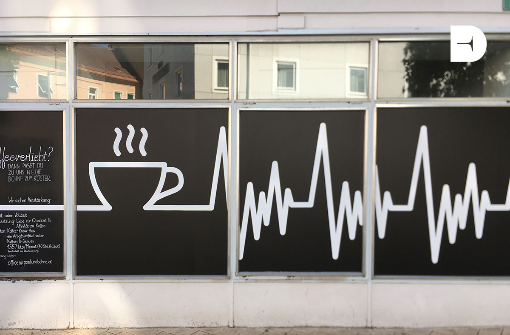

## Claro

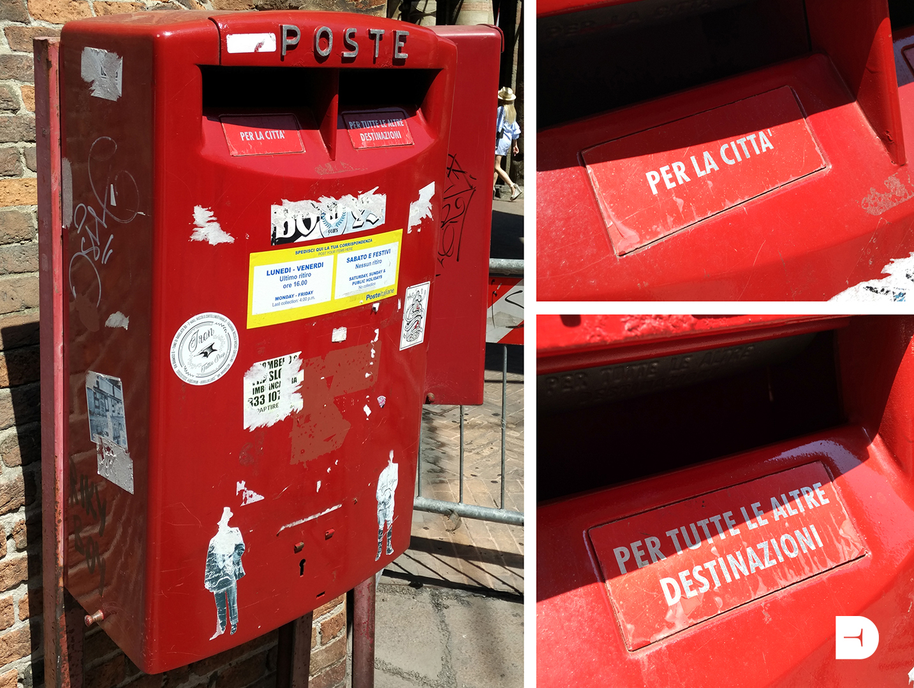

## Diseñar para el error

## Empático

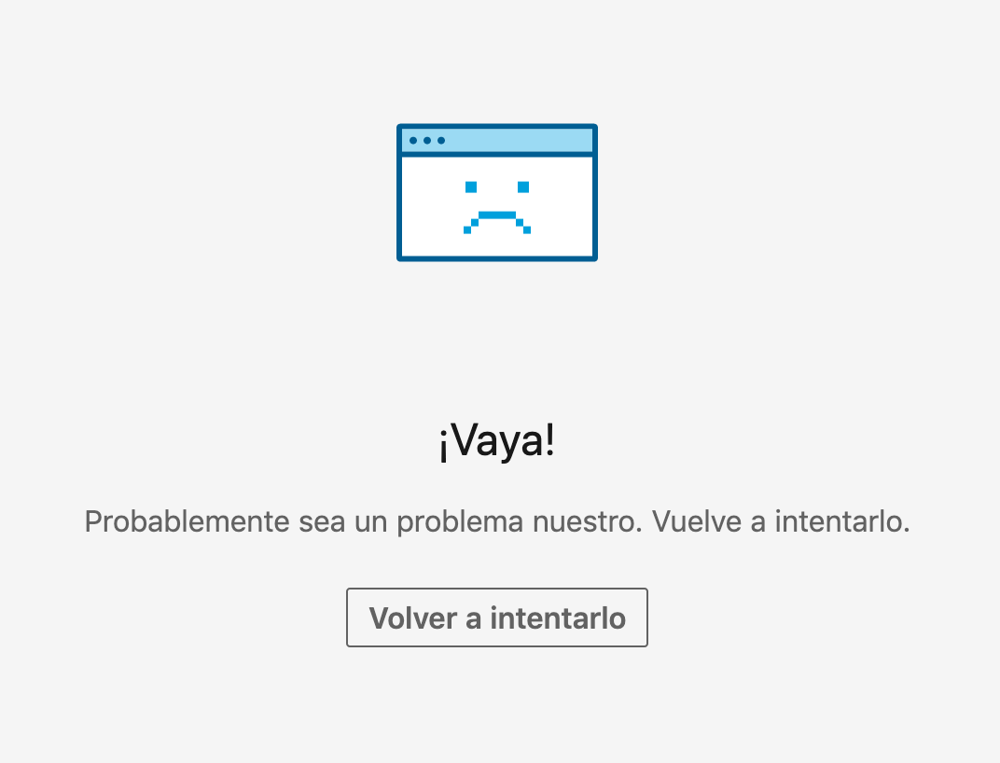

## Eficaz

## Ergonómico

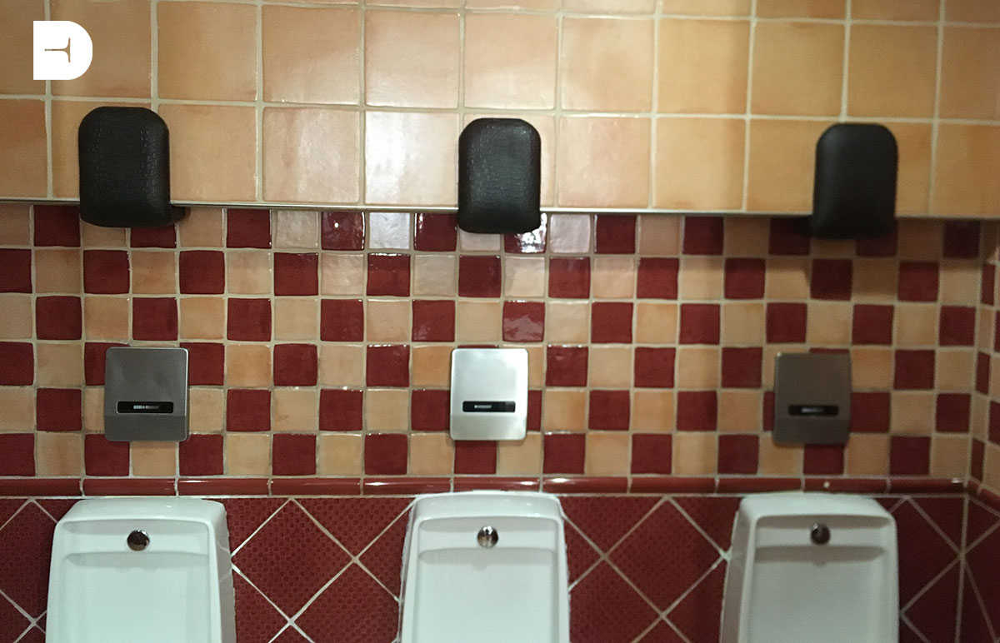

## Humor

## Inmortal

## Imperecedero

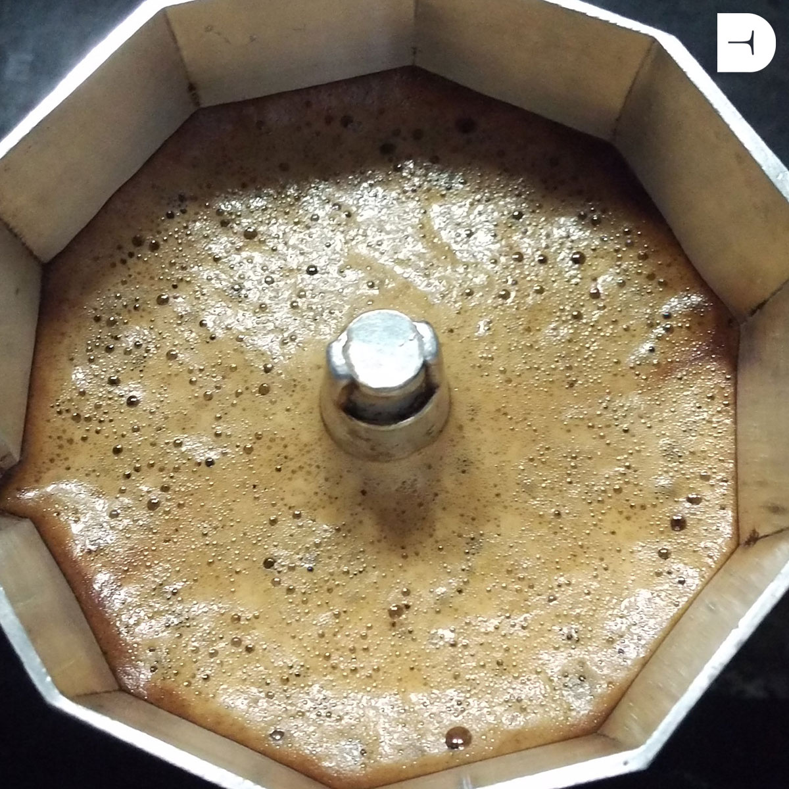

## Kaizen

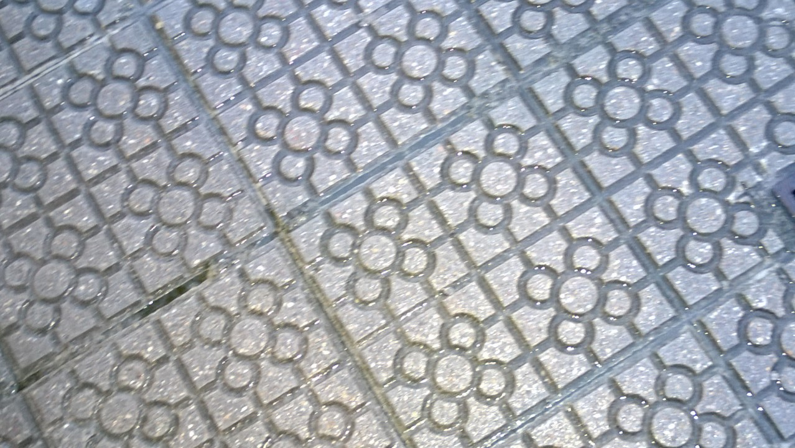

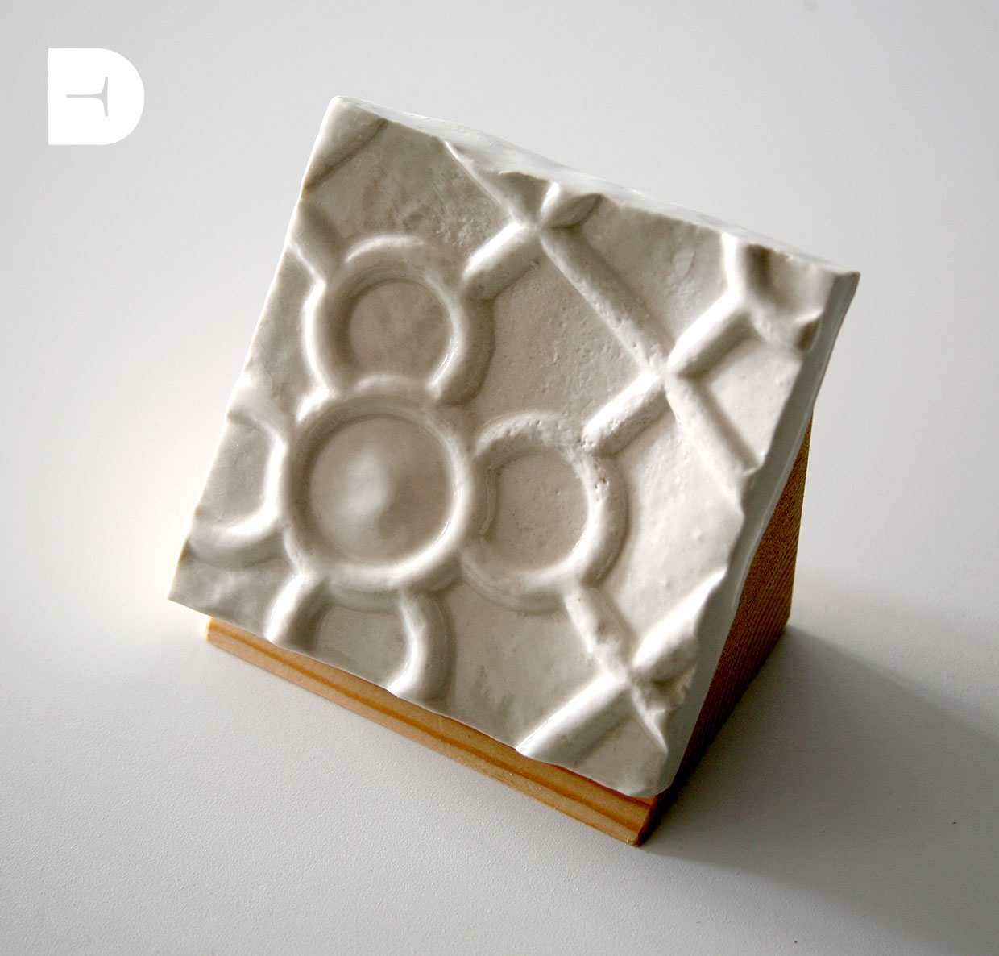

## Sistematizable

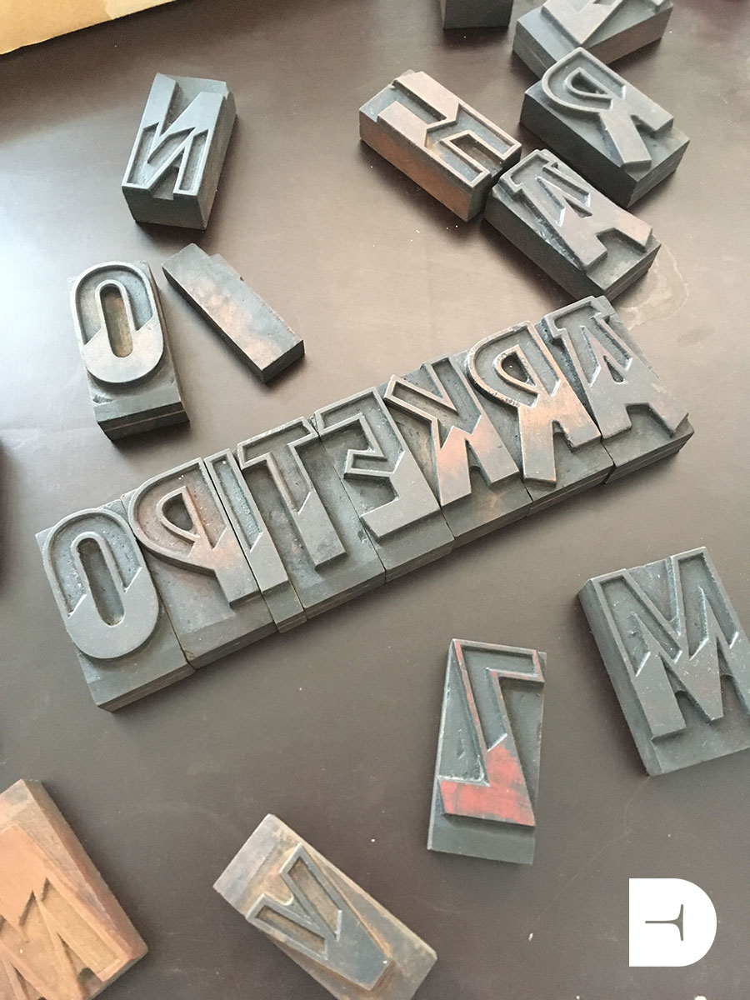

## Seguro

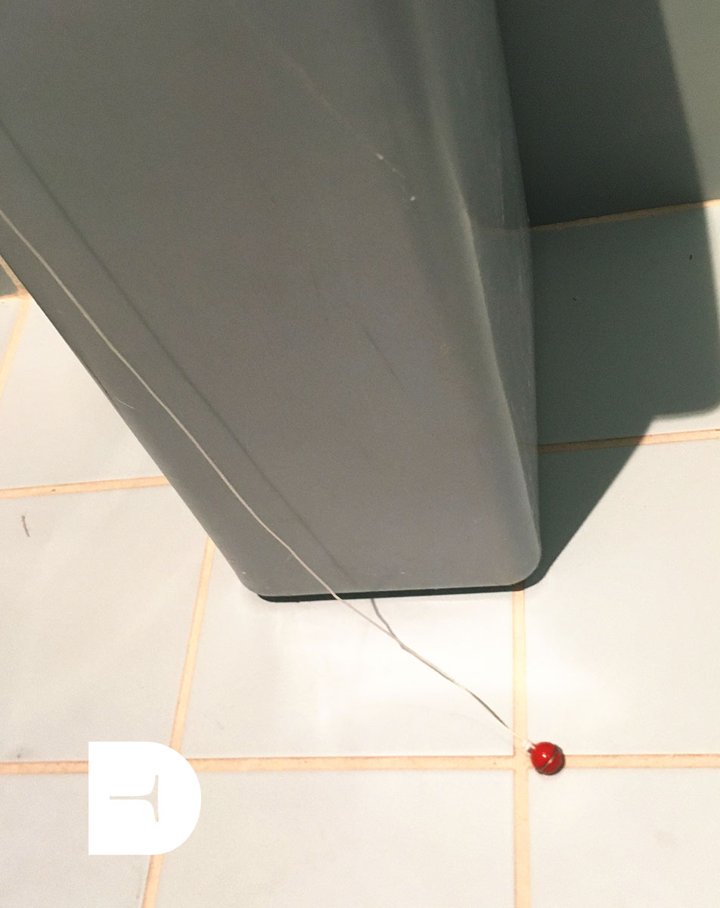

## Sostenible

## Universal

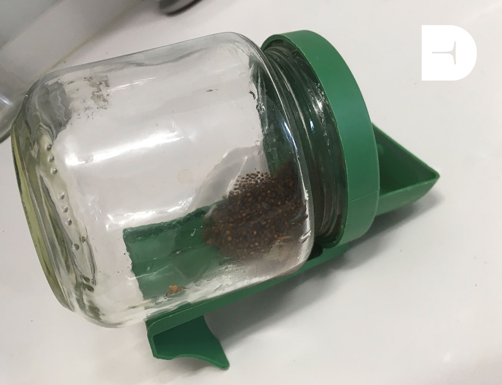

## Versatil

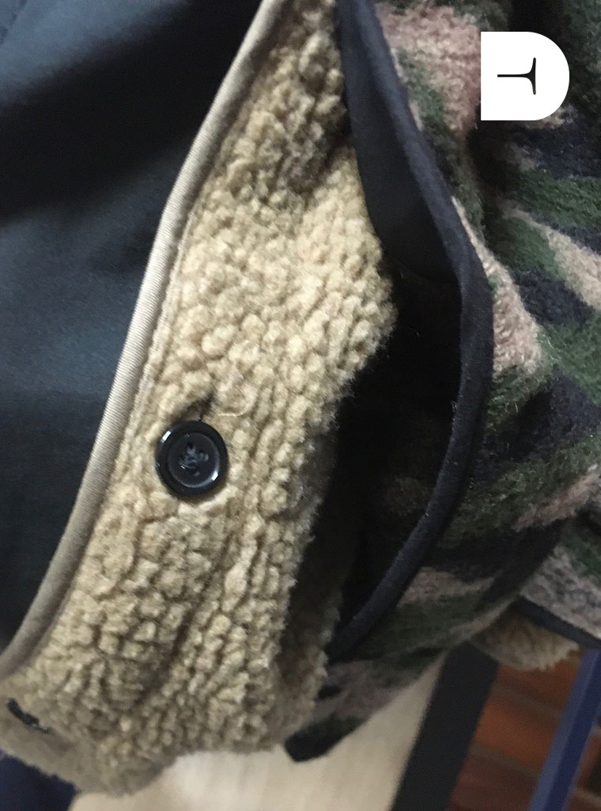

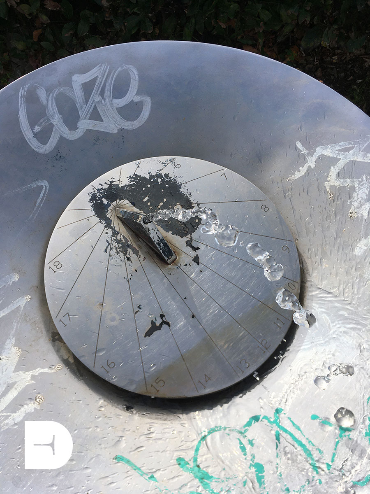

