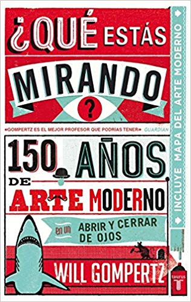

# Arte

Tengo un amigo "artista" que me dice: "**El arte es algo que no sirve para nada**, si tiene una utilidad entonces no es arte". Y me parece algo bastante acertado desde mi punto de vista racionalista.

Pero como vengo del periodismo tengo que contrastar las cosas y hablando con las integrantes del colectivo de [sra. polaroiska](http://cargocollective.com/srapolaroiska), a las que conocí en otro gran evento de Diseño [serifalaris](https://serifalaris.com/), me contaron como el arte podía remover conciencias, provocar el cambio social, impactar, hacer que nos replanteemos las cosas. Y la verdad me quedé con la duda.

Quizás un ejemplo aún más claro es lo que hace el estudio [Boa Mistura](http://www.boamistura.com). Porque lo que hacen ¿es arte o es diseño? Lo que es claro es que a través de un acercamiento artístico consiguen un impacto más allá de lo visual



A mi lo que me ha servido es leerme el libro de Will Gompertz



Que estás mirando para entender el objetivo del arte, las diferentes corrientes, lo que buscaban los autores. Porque es claro que el arte es la vanguardia a la hora de crear experiencias sensoriales y luego nosotros los diseñadores, publicistas, etc. nos apropiamos de lo que funciona al igual que lo hemos hecho siempre con la cultura popular.

